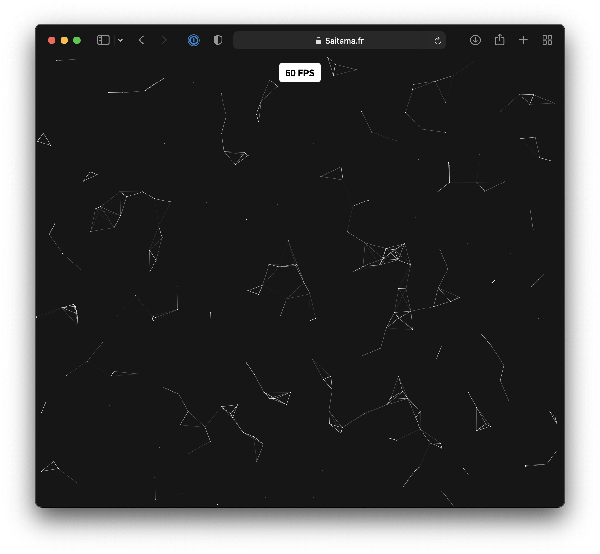

# Proximity Graph
A quick implementation of proximity graph.

## How to build (Release)
```zsh
$ yarn build
```

## How to debug (live debug)
```zsh
$ yarn dev
```
**NOTE** : If you modify the **AssemblyScript** source code, you need to recompile them with `yarn asbuild`